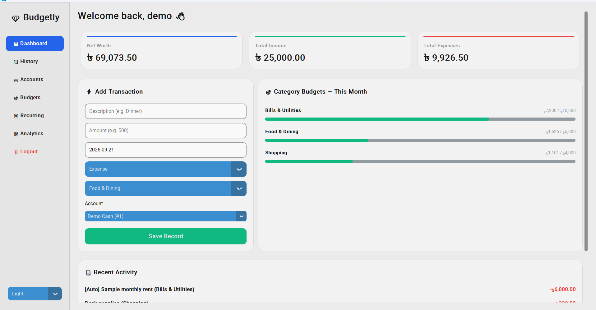

# Budgetly


A Python desktop personal-finance prototype for recording income and expenses, managing accounts, setting category budgets, and transferring money between accounts.

**Version:** 2.3.0  
**Stack:** Python, CustomTkinter/Tkinter, SQLite, Matplotlib, ReportLab

Budgetly was developed iteratively with substantial AI assistance. Its development included identifying and fixing balance-integrity defects, testing recurring payments under simultaneous execution, and migrating monetary values from floating point to integer minor units. It is an educational portfolio project, not a production banking product.

## Features

- Registration, login, password reset using a recovery PIN, and salted PBKDF2 password hashing.
- Separate user accounts and financial records.
- Cash, bank, and mobile-wallet accounts with opening balances.
- Income and expense entry, editing, deletion, search, and category filtering.
- Transfers that update two balances together without inflating income or expense totals.
- Category spending limits and current-month budget progress.
- Monthly recurring rules with unique monthly occurrence records.
- Dashboard charts, CSV export, and paginated PDF transaction reports.
- Integer poisha/cents in SQLite, with Decimal input and display calculations.
- Cached pages, active navigation highlighting, and a short page transition.

## Install on Windows

The owner reported the app working on their Windows/PyCharm setup with Python 3.14. This package has a separate automated installation check described in `docs/TESTING.md`; this is not a guarantee for every Python/Windows combination.

1. Extract this ZIP into a **new folder**, away from your personal Budgetly database.
2. Open a terminal in the extracted `Budgetly_Portfolio` folder.
3. Create the environment and install dependencies:

```powershell
py -3 -m venv .venv
.\.venv\Scripts\python.exe -m pip install -r requirements.txt
```

4. Launch an empty personal application:

```powershell
.\.venv\Scripts\python.exe main.py
```

Or double-click `run_windows.bat` after installing dependencies. That launcher always uses the project folder as the working directory.

For PyCharm, select `.venv\Scripts\python.exe` as the project interpreter and set the run configuration's working directory to the extracted project folder.

Python must include Tkinter. On Windows, the Python installer normally provides Tcl/Tk support. SQLite and Decimal are part of Python; do not install separate `sqlite3` or `tkinter` packages from pip.

## Try the fictional demo

```powershell
.\.venv\Scripts\python.exe demo.py --launch
```

The demo is kept in `demo_data/budgetly_demo.db`, separate from `budgetly_master.db`.

- Username: `demo`
- Password: `BudgetlyDemo2026!`
- Recovery PIN: `7391`

These credentials are public and **only for fictional demonstration data**. The script creates sample accounts, income, expenses, transfers, budgets, and a recurring payment. Running it again reuses the existing demo without overwriting it. If you change its password during a demonstration, use your changed credentials afterward.

To reset the demo, close all Budgetly windows and remove only `demo_data/budgetly_demo.db`, then rerun the command. Do not remove a personal database.

## Run the smoke tests
All 11 smoke tests passed on the project owner’s Windows computer using Python 3.14.

```powershell
.\.venv\Scripts\python.exe -m unittest discover -s tests -v
```

Tests use temporary databases. They do not access your personal database or require a visible window. Passing them does not replace manual Windows interface testing.

## How money works

For example, 100.50 is stored as the integer `10050`. Input is validated with Decimal; SQLite uses integer balance arithmetic; typed reads and aggregate aliases convert stored minor units back to Decimal major units. Chart coordinates can use floats, but those floats are not written back as money.

Transfers are stored separately from income/expense transactions. Changes affecting balances use database transactions so related writes succeed or roll back together.

## Existing databases

This package does not contain a database. If you deliberately upgrade an existing Budgetly installation, close every old instance and back up both its code and database first. Version 2.3.0 automatically creates a `before_2_3_0_*.bak` backup and verifies the money migration. Meaningful fractional cents or invalid records stop migration for repair; they are not silently replaced.

**Never run pre-2.3.0 code against a converted database.** To return to an older release, restore its corresponding pre-migration database backup as well.

## Known limitations

- Recovery still uses a four-digit PIN without attempt throttling. The database is not encrypted.
- Recurring rules use days 1-28, process at login, and do not backfill every missed month.
- Budget limits are not independently versioned by historical month.
- Transfer history shows the latest 50 transfers; there is no transfer-edit/reversal workflow.
- CSV/PDF transaction reports do not include transfers; the PDF says so. Exporting applies to all of the user's income/expense transactions, not the current search filter.
- Default PDF fonts may not render every Bengali/Unicode character correctly.
- There is no complete in-app backup/restore manager.
- The main app resolves its database from the launch working directory. Use the provided launcher or a consistent project working directory.
- The fixed desktop layout can clip on small displays. It is not a mobile-responsive app.
- The source remains primarily a single file, and automated GUI coverage is limited.

## Portfolio materials

- `docs/PROJECT_OVERVIEW.md`: factual project summary and contribution guidance.
- `docs/DEMO_GUIDE.md`: a short demonstration plan and screenshot instructions.
- `docs/TESTING.md`: test evidence and remaining manual checks.
- `docs/PUBLISHING_CHECKLIST.md`: checks before publishing or submitting a link.

Screenshots captured from the running fictional demo are available in docs/screenshots/.

## Attribution and submission

Use the contribution wording only after reviewing it for accuracy. The project owner directed requirements, provided runtime feedback, and reported Windows checks. ChatGPT/Codex generated and modified substantial portions of the implementation and test/documentation material. Do not describe the code as entirely written independently.

Follow the receiving institution's rules for permitted AI assistance and optional supporting materials. This package makes no claim that a particular institution requires, accepts, or will assess a coding portfolio. A GitHub repository has not been published by this packaging step.
